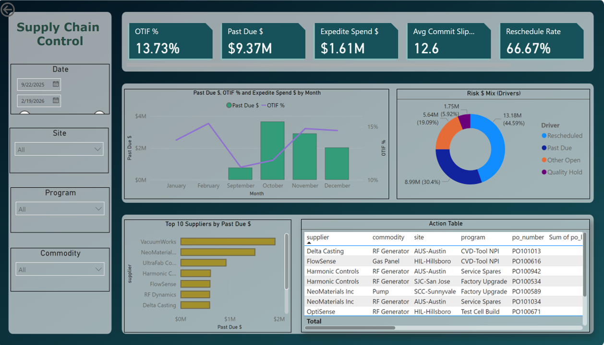

Here’s an updated **README welcome page** that swaps **Tableau → Power BI**, and references your attached PBIX (recommend storing it in the repo under `powerbi/`).

```md
# supply-chain-control 🚚⚡📦
A **Power BI** dashboard + case-study portfolio that mirrors **semiconductor-grade supply chain governance**—spanning supplier performance, PO/commit health, inbound logistics, shortages, and factory readiness for complex tool/module manufacturing.

<p align="left">
  <a href="#"><b>🔗 Power BI Report (add link)</b></a>
  &nbsp;•&nbsp;
  <a href="powerbi/supply_chain_dashboard.pbix"><b>📊 Download PBIX</b></a>
  &nbsp;•&nbsp;
  <a href="docs/kpi_glossary.md"><b>📘 KPI Glossary</b></a>
  &nbsp;•&nbsp;
  <a href="data/schema/data_dictionary.md"><b>🗂️ Dataset Schema</b></a>
  &nbsp;•&nbsp;
  <a href="docs/case-studies/"><b>📚 Case Studies</b></a>
</p>

---

## What this portfolio shows
**Semiconductor-style operating rigor** for hardware manufacturing supply chains:
- **OTIF / Past Due / Commit health** by supplier, commodity, site
- **Lead time drift** and reschedule churn (commit volatility)
- **Inbound logistics performance** (mode, carrier, lane, expedite burn)
- **Shortage early-warning** (time-phased supply vs build demand)
- **Quality holds + NCR impact** on delivery and readiness
- **Factory readiness gating** (kitting, dock-to-stock, critical path parts)

---

## Dashboard overview (Power BI)
Add your screenshots in `docs/images/` and keep these paths unchanged:

**Dashboard Preview**


**Supplier Heatmap Example**


**Pareto / Treemap Example**


> Tip: If you publish the report to the Power BI Service, paste the **Share link** (or “Publish to web” link, if you’re using a public portfolio) into the **Power BI Report** button at the top.

---

## Power BI file
The main report is here:
- `powerbi/supply_chain_dashboard.pbix`

Recommended repo structure:
- Keep the PBIX in `powerbi/`
- Keep measures documentation in `powerbi/measures.md` (optional)
- Keep screenshots in `docs/images/`

---

## Data model
Use either:
1) **Star schema** (recommended for Power BI): facts + dims, documented in `data/schema/schema_star.md`
2) **Flat extract** (fastest setup): `data/processed/fact_supply_chain_flat.csv`

---

## Case Studies (realistic stories + KPIs)
1. **OTIF Recovery for Long-Lead Subsystems (Chambers & RF)**  
   `docs/case-studies/case-study-01-otif-recovery.md`  
   

2. **Expedite Spend Reduction + Lane Discipline**  
   `docs/case-studies/case-study-02-expedite-cost.md`  
   

3. **Shortage Early-Warning for Build Readiness (Next 6 Weeks)**  
   `docs/case-studies/case-study-03-shortage-early-warning.md`  
   

4. **PPV + Quote Variance on Precision Machined Parts**  
   `docs/case-studies/case-study-04-commit-health-reschedule.md`  
   

5. **Line-Down Prevention via ASN + Dock-to-Stock + Kitting**  
   `docs/case-studies/case-study-05-quality-hold-recovery.md`  
   

---

## Quick start (Power BI)
1. Drop CSVs into:
   - `data/raw/po_lines.csv`
   - `data/raw/shipments.csv`
   - (optional) `data/raw/inventory_snapshot.csv`
   - (optional) `data/raw/quality_events.csv`

2. Open the Power BI report:
   - Open `powerbi/supply_chain_dashboard.pbix`
   - Go to **Transform data (Power Query)** and point file paths to your `data/raw/` CSVs
   - **Refresh** the model

3. Validate model setup in Power BI:
   - Confirm **relationships** (Model view)
   - Confirm **date table** and mark it as a Date table (if applicable)
   - Validate KPI measures (OTIF, Past Due $, Expedite $, Commit Slip, etc.)

4. Publish (optional):
   - Publish to **Power BI Service**
   - Paste the **report link** into the “Power BI Report (add link)” button above
   - (If using a public portfolio) use **Publish to web** only with non-sensitive/demo data

---

## Suggested dashboard pages (Power BI)
**Page 1 — Executive Control Tower**
- KPI cards: OTIF, Past Due $, Commit Slip, Expedite $, Shortage Risk, Quality Holds
- Trend: OTIF + Past Due by week
- Heatmap/Matrix: Supplier × Site (late-risk density)
- Slicers: Program/Tool Family, Site, Commodity, Supplier, Month

**Page 2 — Supplier Performance**
- Supplier scorecard table (OTIF, slip, churn, PPM, holds)
- Pareto of late $ / late qty
- Part-level hotlist (top late-risk parts)

**Page 3 — Inbound Logistics**
- Expedite $ trend + mode share
- Lane/carrier on-time + delay reasons
- Dock-to-stock and ASN compliance (if available)

**Page 4 — Readiness & Shortage Risk**
- Next 6-week coverage and risk flags
- Critical-path parts (Tier-A) list with owners and ETAs

---

## License
MIT (see `LICENSE`)
```

If you want, paste your actual Power BI report link (Service share link or publish-to-web link) and I’ll drop it into the top button so it’s ready to copy-paste.
