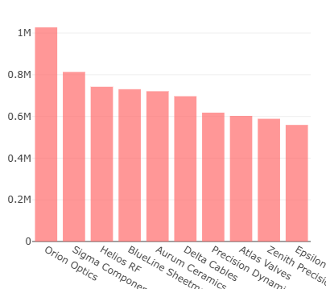

# supply-chain-control 🚚⚡📦  
### Power BI Supply Chain Control Tower — semiconductor-grade execution & governance

A **Power BI dashboard + case-study portfolio** that turns supply noise (PO lines, commits, shipments, holds) into **exec-ready decisions** across supplier performance, inbound logistics, shortages, and factory readiness.

  <a href="docs/images/dashboard_preview.png" target="_blank" rel="noopener noreferrer">
  <b>🚀 Open Power BI Report</b>
</a>
  &nbsp;•&nbsp;
  <a href="powerbi/supply_chain_dashboard.pbix"><b>📊 Download PBIX</b></a>
  &nbsp;•&nbsp;
  <a href="powerbi/supply_chain_dashboard%20Template.pbit"><b>🧩 Template (PBIT)</b></a>
  &nbsp;•&nbsp;
  <a href="docs/kpi_glossary.md"><b>📘 KPI Glossary</b></a>
  &nbsp;•&nbsp;
  <a href="data/schema/data_dictionary.md"><b>🗂️ Dataset Schema</b></a>
  &nbsp;•&nbsp;
  <a href="docs/case-studies/"><b>📚 Case Studies</b></a>

-red)

---

## ✨ What this is
This repo is built like a real Ops/TPM program—**not** a generic dashboard.

- **Executive Control Tower:** KPI scorecards + trends + drilldowns (supplier/site/commodity/part)
- **Root-cause visibility:** commit volatility, late-risk density, and top late-$ drivers
- **Readiness lens:** shortages early-warning + critical-path hotlist behavior
- **Cost governance:** expedite burn & premium freight signal (where data exists)
- **Story-driven proof:** 5 realistic case studies with KPI baselines → recovery actions

> **Use case:** WBR/MBR exec readouts, shortage war-room, supplier QBRs, and factory readiness reviews.

---

## 🖥️ Interactive Dashboard (Power BI)
**Main file:** `powerbi/supply_chain_dashboard.pbix`  
**Template:** `powerbi/supply_chain_dashboard Template.pbit`

**What a hiring manager can do in under 2 minutes**
- Filter by **Supplier / Site / Commodity / Program / Month**
- Identify **late-risk concentration** (heatmap) and top drivers (pareto/treemap)
- Diagnose **commit drift & reschedule churn** before it becomes line-down risk
- Drill into the **part-level hotlist** to drive owner + ETA recovery actions

### Screenshots (keep paths unchanged)
**Dashboard Preview**  

**Supplier Heatmap Example**  

**Pareto / Treemap Example**  

---

## 🔎 Key Findings (from the included sample data)
Below are **sample outputs** you can replace after refresh with your data.

| KPI | Value | Definition |
|---|---:|---|
| **OTIF %** | **13.7%** | On-time **AND** in-full |
| **Past Due $** | **$9,365,982** | Open qty × unit price (need-by < today) |
| **Expedite Spend** | **$1,611,166** | Freight cost where expedite_flag = true |
| **Avg Commit Slip** | **12.6 days** | Delivery date − promise date |
| **Reschedule Rate** | **66.7%** | % lines with reschedule_count > 0 |
| **Quality Hold Rate** | **8.8%** | % lines with quality_hold_flag = true |

**So what? (decision outcomes)**
- Focus recovery on the **top late-$ drivers** instead of chasing every red line
- Convert **commit volatility** into a measurable risk signal (and fix the root cause)
- Treat **shortage risk** as a time-phased readiness gate (next 6 weeks), not a surprise

---

## 🧩 How it works (data → model → insights → actions)
1. **Ingest**: CSV extracts (POs, shipments, optional inventory/quality)  
2. **Model**: Star schema + date table + measures (OTIF, past due, slip, expedite, risk)  
3. **Visualize**: Exec control tower + drilldown pages  
4. **Operationalize**: Hotlists + owners + ETAs + recovery actions (captured in case studies)

---

## 📂 Repo Structure

└─ supply-chain-control/
   ├─ .github/
   │  └─ copilot-instructions.md
   ├─ data/
   │  ├─ processed/
   │  │  ├─ dim_calendar.csv
   │  │  └─ fact_supply_chain_flat.csv
   │  ├─ raw/
   │  │  ├─ inventory_snapshot.csv
   │  │  ├─ po_lines.csv
   │  │  ├─ quality_events.csv
   │  │  └─ shipments.csv
   │  └─ schema/
   │     ├─ data_dictionary.md
   │     └─ schema_star.md
   ├─ docs/
   │  ├─ assets/
   │  │  ├─ app.js
   │  │  └─ style.css
   │  ├─ case-studies/
   │  │  ├─ case-study-01-otif-recovery.md
   │  │  ├─ case-study-02-expedite-cost.md
   │  │  ├─ case-study-03-shortage-early-warning.md
   │  │  ├─ case-study-04-commit-health-reschedule.md
   │  │  ├─ case-study-04-ppv-should-cost.md
   │  │  ├─ case-study-05-line-down-prevention.md
   │  │  └─ case-study-05-quality-hold-recovery.md
   │  ├─ data/
   │  │  └─ processed/
   │  │     └─ fact_supply_chain_flat.csv
   │  ├─ images/
   │  │  ├─ case01.png
   │  │  ├─ case02.png
   │  │  ├─ case03.png
   │  │  ├─ case04.png
   │  │  ├─ case05.png
   │  │  ├─ dashboard_preview.png
   │  │  ├─ Pareto_Example.png
   │  │  ├─ README.txt
   │  │  └─ Supplier_Heatmap.png
   │  ├─ index.html
   │  ├─ kpi_glossary.md
   │  └─ README.txt
   ├─ powerbi/
   │  ├─ supply_chain_dashboard Template.pbit
   │  ├─ supply_chain_dashboard.pbix
   │  └─ supply_chain_dashboard.pptx
   ├─ .gitignore
   ├─ LICENSE
   └─ README.md

---

## 🚀 Getting Started

### Option A — Open the PBIX (fastest)
1. Open: `powerbi/supply_chain_dashboard.pbix`
2. Click **Refresh**
3. Validate visuals + KPI totals

### Option B — Connect your CSVs (Power Query)
1. Drop CSVs into `data/raw/`
2. Power BI Desktop → **Transform data**
3. Update file paths/parameters to point at `data/raw/`
4. **Close & Apply** → **Refresh**

### Option C — Publish (optional)
1. Publish to **Power BI Service**
2. Replace the top link:
   - `🚀 Open Power BI Report (add link)` → paste your report URL

> If this repo is public, use **sanitized/demo data only**.

---

## 🧱 Schema (minimum fields)
Your CSVs should support fields like:

**PO lines**
- `po_number, line_id, supplier, commodity, site, part_number, open_qty, unit_price, need_by_date, promise_date, reschedule_count`

**Shipments**
- `shipment_id, carrier, mode, lane, ship_date, delivery_date, expedite_flag, freight_cost`

**Inventory snapshot (optional)**
- `part_number, site, on_hand_qty, safety_stock, snapshot_date`

**Quality events (optional)**
- `part_number, supplier, quality_hold_flag, ncr_id, event_date, disposition`

See: `data/schema/data_dictionary.md`

---

## 📚 Case Studies (realistic stories + KPIs)
Each case study is written like a real ops readout: **baseline → driver analysis → actions → results**.

1. **OTIF Recovery for Long-Lead Subsystems (Chambers & RF)**  
   `docs/case-studies/case-study-01-otif-recovery.md`  
   

2. **Expedite Spend Reduction + Lane Discipline**  
   `docs/case-studies/case-study-02-expedite-cost.md`  
   

3. **Shortage Early-Warning for Build Readiness (Next 6 Weeks)**  
   `docs/case-studies/case-study-03-shortage-early-warning.md`  
   

4. **Commit Health + Reschedule Churn (Volatility Control)**  
   `docs/case-studies/case-study-04-commit-health-reschedule.md`  
   

5. **Line-Down Prevention via ASN + Dock-to-Stock + Kitting**  
   `docs/case-studies/case-study-05-line-down-prevention.md`  
   

---

## 🗺️ Roadmap (optional)
- [ ] Add **risk scoring**: late $ × criticality × lead time × volatility
- [ ] Add **owner/ETA workflow** for part hotlist (recovery tracker page)
- [ ] Add **Exec export pack** (PDF snapshot for weekly readouts)
- [ ] Add **PPV / should-cost** drilldown as a dedicated page (case study tie-in)

---

## 🔒 License
**Private License — All Rights Reserved**

This repository and its contents are private and proprietary.  
No part of this project (code, data, PBIX/PBIT, documentation, visuals) may be used, copied, modified, or distributed without explicit written permission from the author.

---
